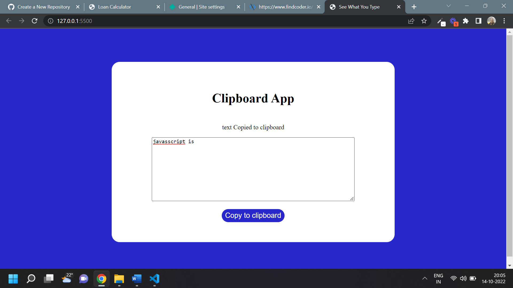

# Javascript Clipboard App

## Clipboard app [Live Link](https://clipboradapp.netlify.app/)

- Skills Gained in this project

  - Use clipboard api

---

## Time taken to finish this project

- 20 minutes to complete it

#### Screenshot

